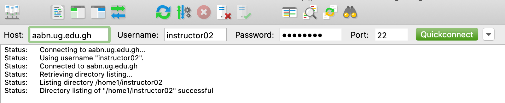
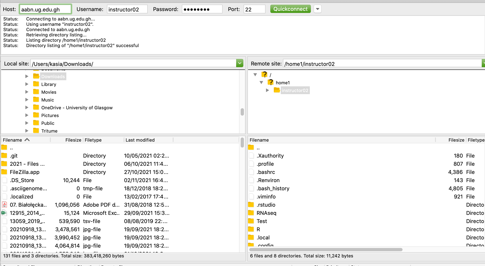

# RNA-seq 

### Background

The mutants of two different ttanscription factors (PBANKA_0905900 and PBANKA_1231600) were generated in the rodent malaria model Plasmodium berghei. The parasites were grown til the stage were the phenotype was observed. Wild-type controls were included. The data from this experiment can be see in the following folder:

	/home1/instructor02/RNAseq/

### Aims

The questions we want to ask is:

1) Are the transcriptomes of the two parasites lines diffrent from the WT?

2) Are they diffrent from each other?

3) What genes changed their expression?

In order to thiis we will:

1) align the reads to the refernce genome in splice-aware manner using HISAT2 software
2) visualise and inspect the alignment
3) count how many reads map to each gene using featureCounts software
4) use a statistical model to identfy the genes that are diffrentially expressed between the different lines

### Part 1: Data preparation:

Log in to the cluster using command line:

	 ssh -X afbpXX@aabn.ug.edu.gh 

First create a dedicated folder for RNAseq analysis:

	mkdir MyRNAseq

	cd MyRNAseq

Now copy there the RNAseq fastq file

	cp -r /home1/instructor02/RNAseq/Fastq/ .

You will aslso need the genome to align your data to. We can download the lastest version directly from PlasmoDB

	cp /home1/instructor02/RNAseq/PlasmoDB-54_PbergheiANKA_Genome.fasta .

and later in the gff file - a small text file that gives you the position of all the imoportant features within the geneome

	cp /home1/instructor02/RNAseq/PlasmoDB-54_PbergheiANKA.gff .

You can use **head -n 50 <file>**  to look at the first 50 lines of that file and see its struture

*Note:it is always important to download your genome and feature file form the same source! Imagine what happenes if they use diffrent system for the chromosme names or if all genome annotations are moved 5kb downstream!*

Normally you would perform the quality control at this stage using FastQC or similar. We will skip that part here to save time but you can run it later in your own time.

### Part 2: Alignment

Using HISAT2, we can align our sample reads (* .fastq files) to the reference genome. Doing so will generate our SAM (Sequence Alignment Map) files we will use in later steps. First however we need to index the genome in question so the software can use it. Thsi will be done using hisat-build algorithm as follows:

	hisat2-build PlasmoDB-54_PbergheiANKA_Genome.fasta PBerg

in this case:

**PlasmoDB-54_PbergheiANKA_Genome.fasta** - specifies the genome you want to use
**PBerg** - this is the name we give to  the index, it may be anything you want eg. MyGenome but something sgort and informative is recommended

Now that the genome is indexed you can align the reads against it. You do by calling "hisat2" command with some key atributes. 

-- fr (or rf)    # specifies what type of library it is, here stranded with first read mapping to the 'forward' strand of RNA 
-x <index name>  # this is the name you have given to your indexed genome, tells the software what you should align it to
-1 <fastq file>  # first file with the reads, containing first reads of each pair
-2 <fastq file>  # second file with the reads, containing second reads of each pair
-S <file> 		 # output file name, again you should name it in a way that will allow easy identfication. Keeping the name of * fastq file and changing •fastq to * sam is a common solution
 
Knowing this let's try to align one sample. Choose any of the ones you are given but make sure you use two complmnetary * fastq files, with forward and reverse reads from the same sample. Their name should be identical except the last digit.

	hisat2 --fr -x PBerg -1 Fastq/wt_O_1-1_1.fastq.gz -2 Fastq/wt_O_1-1_2.fastq.gz -S wt_O_1-1.sam

*Note: As it is a computationally intensive process it can take few min to run! Be patient! Also in some systems it may show syntax error but still complete the alignment*

You should recieve something similar as an output:

	5797831 reads; of these:
	  5797831 (100.00%) were paired; of these:
	    337512 (5.82%) aligned concordantly 0 times
	    5376890 (92.74%) aligned concordantly exactly 1 time
	    83429 (1.44%) aligned concordantly >1 times
	    ----
	    337512 pairs aligned concordantly 0 times; of these:
	      31631 (9.37%) aligned discordantly 1 time
	    ----
	    305881 pairs aligned 0 times concordantly or discordantly; of these:
	      611762 mates make up the pairs; of these:
	        342332 (55.96%) aligned 0 times
	        264437 (43.23%) aligned exactly 1 time
	        4993 (0.82%) aligned >1 times
	97.05% overall alignment rate 

"concordant" alignment is the one consistent with specified library conformation (one strand on forward, other on reverse). "discordant" alignment is still matching the geneome but the read orientation is not what you expected. You can test it by running a the same command using --rf in stead of --fr parameter and see how it impacts the numbers. The last number of  this output is the important one as it shows what % of your reads can be mapped to the genome. If that number is too low that may mean that your sample was contaminated with another organism :( Or is really low quality.

You can also use an alignment quality control tool. **Samtools stats** is the part **samtools** package - a group of programs made to manipulate NGS alignment files. 

	samtools stats wt_O_1-1.sam

That is a lot of output that gives you! You may need some tools (like R) just to process it. You may do it in your spare time. For now we can cut just keep the first part of the outpuut with this command:

	samtools stats wt_O_1-1.sam | grep ^SN | cut -f 

and see all key stats of that file.

You can also just open it with any text editor - SAM is a human readable text format. Just beware - even with just 1M reads, it is big. Let's try to open first 20 lines (remember your Linux tutorial?)

	head -n 20 wt_O_1-1.sam

### Part 3: File preparation

The file we have generated so far is a SAM file. It is not the most effeicent storage format nor it is the easiest one for the other tools to work on. We want to change that.

First we need to tranform it into a compressed file format called BAM. **Samtools view** (another part of samtools package) is the way to do it. It reads the alignement file and can write it back in different  format.

	samtools view -O BAM -o wt_O_1-1.bam wt_O_1-1.sam

Splitting this line:
	
	samtools view - calls the program
	-O  is a parameter indicating in which format we want the output in 
	-o  is indicatng where to write that output (gives the name of the output file)
	<SAM file> - indicates the file we want to process (here wt_O_1-1.sam)

BAM is a compressed machine readable format. If  you try to open it like a SAM file with the text editor you will get a not-so-useful sequence of signs (try the same command as you did with the SAM file!)

You can also try **ls -lh** to check how much smaller the file is.

	-rw-rw-r-- 1 instructor02 instructor02 672M Nov  2 10:20 wt_O_1-1.bam
	-rw-rw-r-- 1 instructor02 instructor02 3.8G Oct 31 17:47 wt_O_1-1.sam

The next step is to sort the file. The reads are now positionned at random. We will try to put them in order:

	samtools sort -o wt_O_1-1S.bam wt_O_1-1.bam

That will create a new file **wt_O_1-1S.bam** in which all the reads are sorted according to their position in the genome. The last thing we will do is to use the indexing tool to create an index file - a samller file acting as a map and allowing the software to navigate the bigger file more efficiently.

	samtools index wt_O_1-1S.bam

Now run again *ls -l* command. Do you see an additional file?

### Part 4 (optional) visualisation:

We can now see how our alignement loks like. IGV is one of the few tools that make it possible. Anything that involves a graphical represnatations of very large files can  be memory intensive so it is better to run it on your local machine. To so this please download from your folder 3 files needed for the visualisation:

* genome file (fasta)
* gene annotation file (gff)
* sorted alignement files (bam)
* its associated index file (bam.bai)

You can do it easily using filezilla software or scp command

Example of filezilla:

That will open the folder structure you have created on the serwer

you can just drag  and drop teh files to your local computer.

### Part 5 read counting

Now last part of the read processing - we want to count how many reads align to each genome of interests. One of the ways we can do it is to use the Rsubread packges in R. To do this:

1) make sure you know where your sorted BAM file is (which folder, how far removed in your ~ ("home") directory)
2) make sure you know where your GFF (genome feature file) file is
3) log in to the R serwer. 

**From now on the code provided will have to pasted in the R console window and not the terminal**

First we need to load the requiried pacakge for counting

	library(Rsubread)

Now we will use ''''featureCounts'''' function from this package. As for all functions you can type help(featureCounts) to open a litte document explaining what the fucntion does, what options you can use with it etc. As usual this document is complex and not always easy to digest.

	featureCounts(
		"~/RNAseq/wt_O_1_1S.bam",					 #what file you perform the operation on, you need to provide a full path so the software knows where to find it
					annot.ext="~/RNAseq/PlasmoDB-54_PbergheiANKA.gff",  			#file specifying the features of the  genome (tells the function whcih bits are the genes)
					isGTFAnnotationFile=TRUE, 				#tells in what format the features file is
					GTF.featureType="exon", 					#tells what type of features you map to, exon is the usual one but sometimes you may want to cou something else eg. promoters, introns, UTRs
					GTF.attrType = "gene_id" 				#we want the  data pooled by gene rather than each exon analysed as a separte fetaure
					isPairedEnd = TRUE, 					#indicates that the reads are paired-ended
					strandSpecific=2 					#tells how the libray was prepared 
					)

Now we want to run that function and write its output as an object. Feel free to pick a relevant name. For example like this:

	MyWtCounts <- featureCounts("~/RNAseq/wt_O_1_1S.bam",annot.ext="~/RNAseq/PlasmoDB-54_PbergheiANKA.gff",isGTFAnnotationFile=TRUE,GTF.featureType="exon",GTF.attrType = "gene_id",isPairedEnd = TRUE,strandSpecific=2)

You should see soomething like this:
 
	        ==========     _____ _    _ ____  _____  ______          _____  
        =====         / ____| |  | |  _ \|  __ \|  ____|   /\   |  __ \ 
          =====      | (___ | |  | | |_) | |__) | |__     /  \  | |  | |
            ====      \___ \| |  | |  _ <|  _  /|  __|   / /\ \ | |  | |
              ====    ____) | |__| | |_) | | \ \| |____ / ____ \| |__| |
        ==========   |_____/ \____/|____/|_|  \_\______/_/    \_\_____/
	       Rsubread 2.4.3

	//========================== featureCounts setting ===========================\\
	||                                                                            ||
	||             Input files : 1 BAM file                                       ||
	||                                                                            ||
	||                           wt_O_1-1.bam                                     ||
	||                                                                            ||
	||              Paired-end : yes                                              ||
	||        Count read pairs : yes                                              ||
	||              Annotation : PlasmoDB-54_PbergheiANKA.gff (GTF)               ||
	||      Dir for temp files : .                                                ||
	||                 Threads : 1                                                ||
	||                   Level : meta-feature level                               ||
	||      Multimapping reads : counted                                          ||
	|| Multi-overlapping reads : not counted                                      ||
	||   Min overlapping bases : 1                                                ||
	||                                                                            ||
	\\============================================================================//

	//================================= Running ==================================\\
	||                                                                            ||
	|| Load annotation file PlasmoDB-54_PbergheiANKA.gff ...                      ||
	||    Features : 13969                                                        ||
	||    Meta-features : 5254                                                    ||
	||    Chromosomes/contigs : 21                                                ||
	||                                                                            ||
	|| Process BAM file wt_O_1-1.bam...                                           ||
	||    Strand specific : reversely stranded                                    ||
	||    Paired-end reads are included.                                          ||
	||    Total alignments : 5969447                                              ||
	||    Successfully assigned alignments : 4706253 (78.8%)                      ||
	||    Running time : 0.26 minutes                                             ||
	||                                                                            ||
	|| Write the final count table.                                               ||
	|| Write the read assignment summary.                                         ||
	||                                                                            ||
	\\============================================================================//

Now you have an object called *MyWtCounts* with various characteristics. The important one is the actual count table:

	MyWtCounts$Counts[1:50,] 

Should print you the gene names with associated read count

	PBANKA_0932200  PBANKA_1112300  PBANKA_0832100  PBANKA_1307600  PBANKA_0818100  PBANKA_1329900 
  	          133             371             663             150             210             483 
 	PBANKA_1142400  PBANKA_1360200  PBANKA_1219900  PBANKA_0210300  PBANKA_1300071  PBANKA_0700071 
  	          352             173             524             950              85              56 
 	PBANKA_0942000  PBANKA_1127700  PBANKA_0933900  PBANKA_1216800  PBANKA_0006701  PBANKA_1241800 
  	          912              49              57            2767               1             664 
 	PBANKA_0806700  PBANKA_0826400  PBANKA_0943300  PBANKA_1141200  PBANKA_0302200  PBANKA_1219800 
  	          374             309              48              17             732              77 
 	PBANKA_0912100  PBANKA_1211700  PBANKA_0314400  PBANKA_0714800  PBANKA_1009200  PBANKA_1337100 
  	         1819             206             389             182             559            1298 
 	PBANKA_0938800  PBANKA_0100100  PBANKA_1121100  PBANKA_0302400  PBANKA_0216081  PBANKA_1363400 
 	          5550              19             384             763               8              43 
 	PBANKA_1414900  PBANKA_0813600  PBANKA_0941500  PBANKA_0721300  PBANKA_0408800  PBANKA_1425700 
 	           191             668             536              91             157              21 
 	PBANKA_1430100  PBANKA_1222800  PBANKA_1011900  PBANKA_1443000  PBANKA_0720900 PBANKA_API00180 
 	           384            2595              63            5321             592               0 
	PBANKA_1308700  PBANKA_0903600  PBANKA_1221600  PBANKA_0616800  PBANKA_1352200  PBANKA_1023300 
  	           95             240            1739            1968             512             341 
 	PBANKA_1309400  PBANKA_0620700  PBANKA_1209400  PBANKA_1311100  PBANKA_0802000  PBANKA_1417100 
  	         1456             378            2275              33             894             203 
	

As you see the level of expression of eah gene is different - some of them will be covered just by one or two reads, the others have thousands. 

**Ok so we do have read counts for ONE file. This set of operations (mapping, processing, counting) needs to be performed on all files now. Normally you can automate this process using set of commands combining different operations in the pipeline that can be run on multiple files (sometimes in parallel if you have access to the computer cluster). But today in the interest of time we will skip the processing of the rest of the files - it was done for you!**

### Differential expression:

First download the table of read counts:

	GeneCounts<-read.table(file="/home1/instructor02/RNAseq/Counts.tsv", row.names = 1,sep="\t", header=TRUE)

That R function just reads the R file. Specifically:

**file** - gives you the path to the file you want to read
**row.names** - tells that one of the columns should be used to name your rows
**sep** - what character separates the cells of your table. Here it is tab
**header** - indicates that the first row of this table is not data but the list of column names

now check how this table looks:

	head(GeneCounts,n=30)

You should see a table when columns are sample and rows are the gene ids:

              Mut2_1 Mut2_2 Wt_1 Wt_2 Wt_3 Mut1_1 Mut1_2 Mut1_3
	PBANKA_0000101      0      0    0    0    1      1      1      1
	PBANKA_0000201      0      0    0    0    0      0      0      0
	PBANKA_0000301     64     28   20   50   67      9     16     28
	PBANKA_0000401      0      0    0    1    0      0      1      1
	PBANKA_0000600      4     10    3    5    4      1      6      2
	PBANKA_0000701      0      2    0    0    1      0      0      0

We probably known what is what here (Wt_1 for example is wild-type line, replicate 1) but the software does not. We need some explanations. That comes in form of little table, each row of which corresponds to a column in the data table. You can download a table like this here:

	SamplePlan<-read.table(file="/home1/instructor02/RNAseq/SamplePlan.txt", header=TRUE, sep="\t", row.names = 1)

Let's look at this file:

		SamplePlan

You should see the table when rows - are the sample names from the data table and each of the columns gives some charactristics of the sample. You need to include the that you want to test for - here the parasite strain that the sample is comming from. But you can out anything else you want: date, person preparing the sample or what color of the labcoat you were wearing. 

Once we have both of these we can use software to do staticial analysis. We need to download the required R package:

	library("DESeq2") 

The data needs too be presnted as a particular object

	dds <- DESeqDataSetFromMatrix(countData = GeneCounts, colData = SamplePlan,design = ~ Strain)

Within this function with create a machine friednly object that contains:

	 countData - our gene counts in the matrix format
	 colData - all metadata associated with the experiments in "each row is a sample" format
	 design - explantion how the counts for each gene depend on the variables in colData, typically the difference we are interesed in

We can clean the reads a bit renoving everything that is not expressed across libraries:

	keep <- rowSums(counts(dds)) >= 10
	dds <- dds[keep,]

Now we can fianlly  perform normalistaion and statistical analysis. All you need for that is one function

	ProcessedOutput <- DESeq(dds)

That creates an output that from whichh a number of informations and statistics can be extracted. One of them is normalised data with variance stabilising transfoemation that can be used for plotting and comparing thhe expression of indvidual genes.

	vsd<-vst(ProcessedOutput)

It can be used among other thing too compare how similar the samples are to each other using a PCA plot:

	plotPCA(vsd,intgroup="Strain")

It shows hoow distance  the samples are from each other.

Hmm the samples seem too be pretty diffrent! 

Another important thing you can extract from it is the list of differentially expressed genes. Do do this type:

	res_mut1<- results(ProcessedOutput,contrast= c("Strain","Mut1","wt"))

That formula extract from the output a table of diffrentialy exprssed genes based on the contrast between the two conditions. It will look something like this:

	log2 fold change (MLE): Strain Mut1 vs wt 
	Wald test p-value: Strain Mut1 vs wt 
	DataFrame with 6 rows and 6 columns
                baseMean log2FoldChange     lfcSE       stat      pvalue       padj
               <numeric>      <numeric> <numeric>  <numeric>   <numeric>  <numeric>
	PBANKA_0000301  34.17544     -1.5729404  0.490169 -3.2089788 0.001332073 0.00463796
	PBANKA_0000600   4.09444     -0.7440205  1.012004 -0.7351956 0.462220400 0.58767856
	PBANKA_0001001 361.82338     -0.8463452  0.239537 -3.5332570 0.000410473 0.00165994
	PBANKA_0001101  24.87864      0.2612464  0.510489  0.5117571 0.608821032 0.71462311
	PBANKA_0001201  11.00804     -0.4253000  0.727425 -0.5846649 0.558773063 0.67273511
	PBANKA_0001401   4.22879     -0.0649223  0.991067 -0.0655075 0.947769913 0.96338517

The columns from left to righ indicate:

	row names = genes
	baseMean = average expression level of the genes in your libraries
	log2FoldChange = fold change of expression between the two conditions
	lfcSE = standard error of log2FoldChange
	stat = result of the Wald statistical test
	pvalue = P value ased on the previous test
	padj = P values corrected for mutiple testing

You can also easily extract the differences betweeb the second mutant and the wild-type;

	res_mut2<- results(ProcessedOutput,contrast= c("Strain","Mut2","wt"))

Or two mutants:
	
	res_mut3<- results(ProcessedOutput,contrast= c("Strain","Mut2","Mut1"))

Each of these list can be ordered so we see the genes with lowest P values:

		res_mut1[order(res_mut1$padj),]

or we can select only the genes with P values under certain tershold:

	res_mut1<-na.omit(res_mut1)

	res_mut1[res_mut1$padj<0.05,]

Each of these can be written to a file that can later be exported, send to your collaborators or opened in eg. excel for inspection. For example this will write down the object *res_mut1* as a tab-delimited text file named DEresults.txt

	write.table(res_mut2, file='DEresults.txt', sep="\t")

Now you can experiment with the results!

Try to check:

1) how many genes are differentially expressed between the twoo mutants?
2) What is the gene with the biggest expression diffrence between Mut1 and Wt?
3) I any of the 10 most abundany transcripts diffrentially expressed between Mut2 and wt?

#### *** Congratulations! ***

You made it till the end! Hope you enjoyed the tutorial. Feedback welcome.

